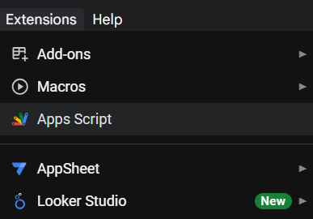
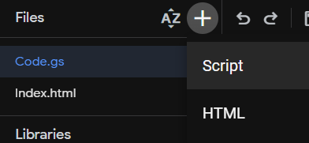
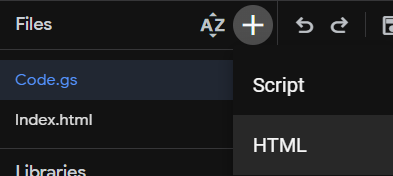
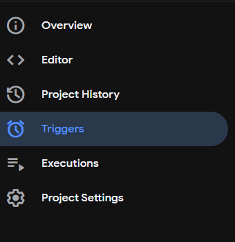
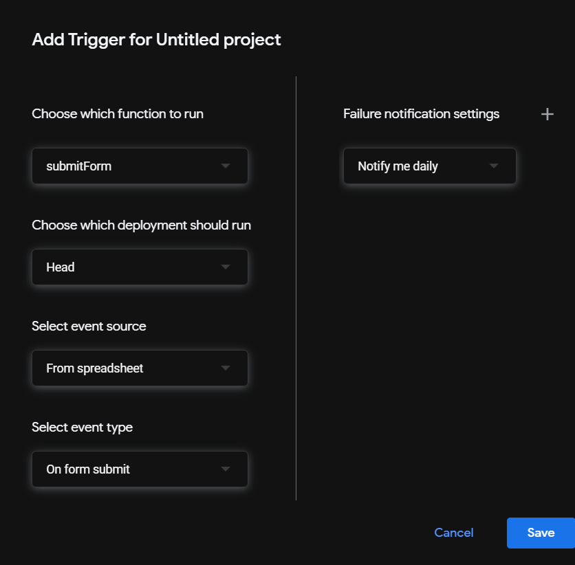
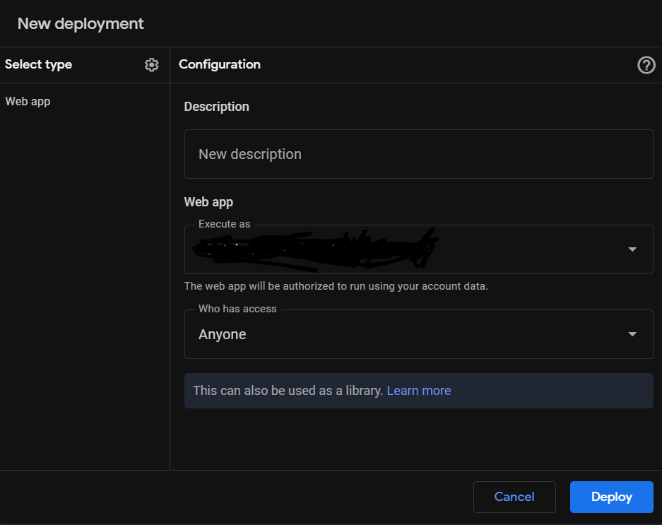
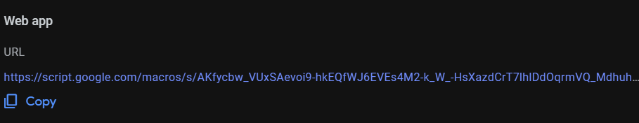

# this a guide on how to set it up 

 
### 1st create a spreadsheet using google docs 
### tap extention bar and select app scripts

### then create a script file 

### copy paste the js code inside it and call it wht ever you want

### then craete a new html file 

### copy paste html file inside it and you must call it Index 

### then make a trigger

### to get to trigger making window press this 

### then create a trigger 

### make settings like this 

### then save

### lastly deploy the program

### click new deployment 

### select type web app 

### then select the rest like this 

### then deploy 

### copy this link this is the website you can add it to a shorten link for better domain

